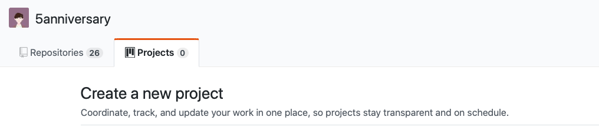
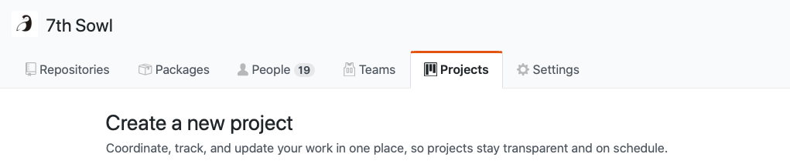
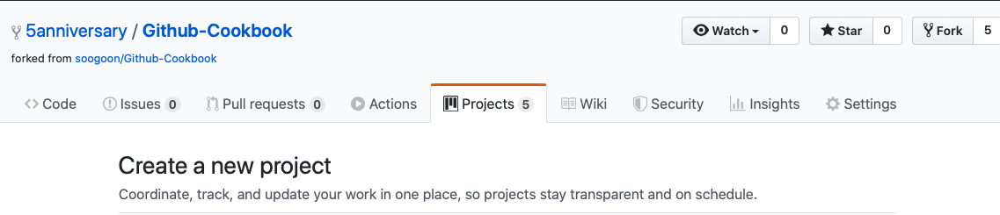
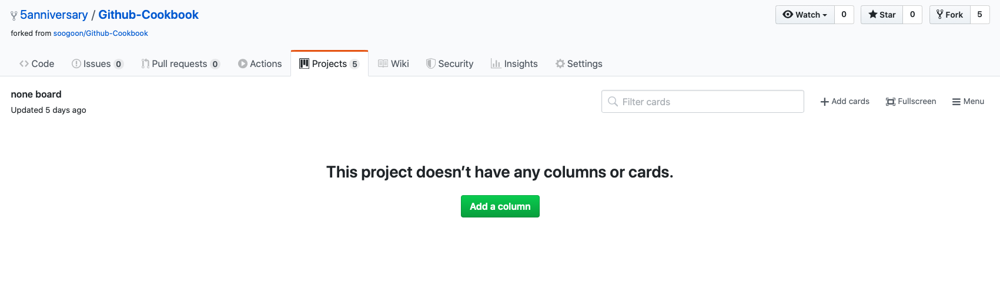
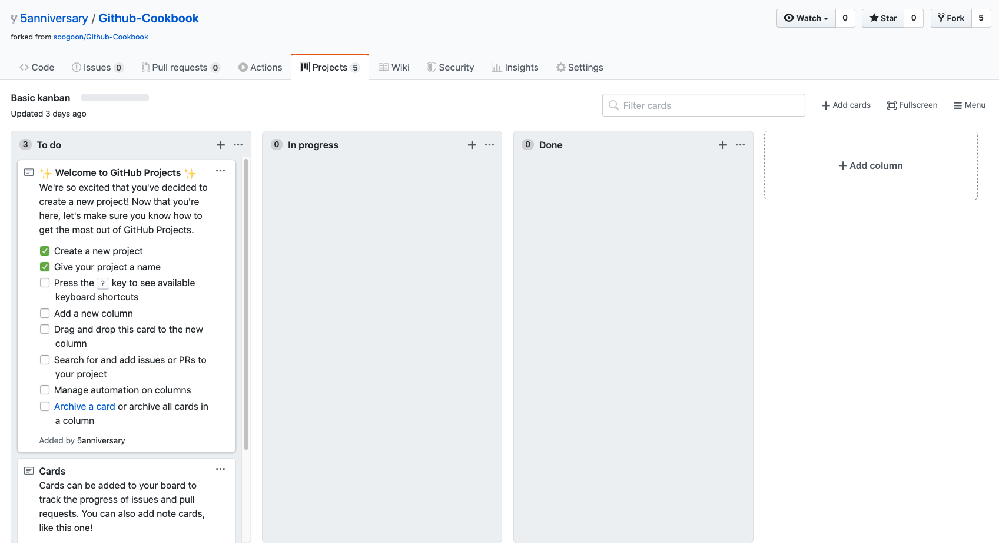
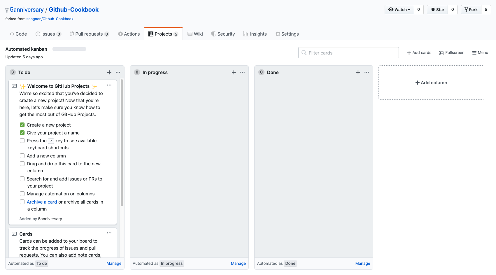
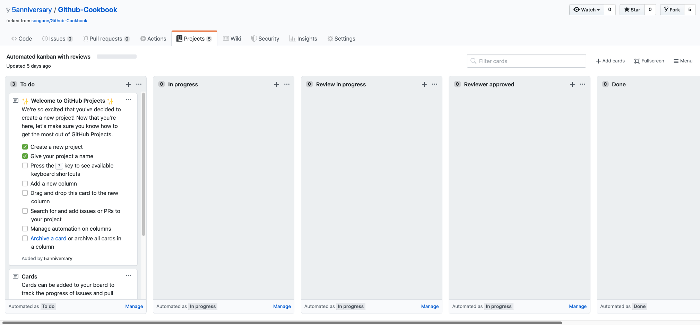
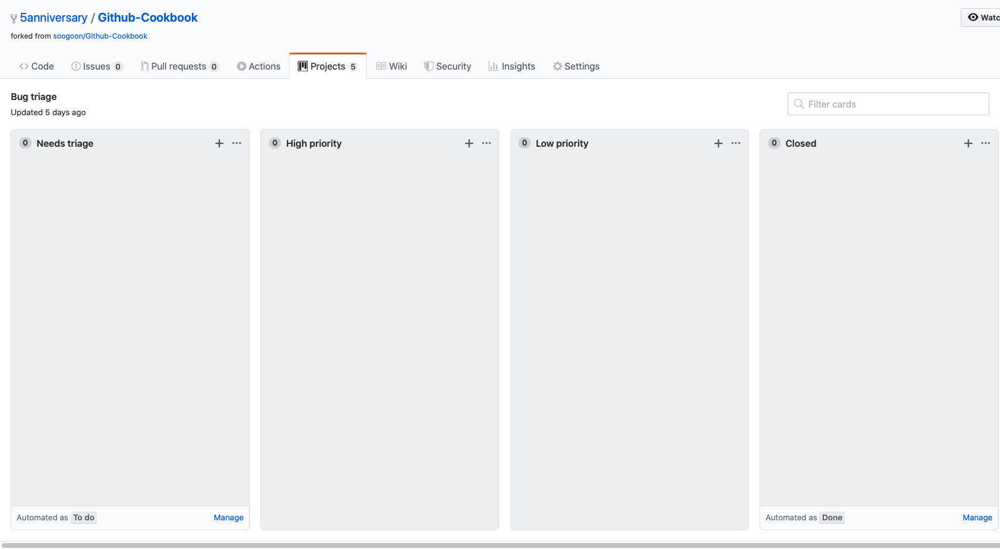

# About Project Boards

Github에서 제공하는 project탭에 대해 차근차근 알아보는 시간을 가지도록 합시다!

프로젝트는 이슈, 마일스톤, 코드리뷰, 일정관리, 버그 리포트등 깃에서 제공 되는 기능을 한눈에 볼수있고 간편하게 조정할수있는 탭입니다.

처음 project 탭에 들어가게 되면 Project에 사용에 대한 설명이 기본적으로 되어있는데요. 

1. 작업 정리 : 우리들의 Project Board에 issue와 pull request들을 더하고, 우선 순위대로 노트카드 안에 idea와 업무 리스트를 정리 합니다.
2. 프로젝트 계획 : "To Do" , "In Progress", "Done"와 같은 기준을 정해 작업을 상태를 정렬합니다. 
3. Workflow의 자동화 : 트리거를 설정해 프로젝트 관리 시간을 절약할 수 있습니다,
4. 진행 상황 추적 : 프로젝트에서 일어나는 모든 일을 추적할 수 있고, 마지막으로 본 이후에 어떤 일이 생겼는지 확인이 가능합니다. 
5. 상태 공유 : 카드마다 각각 고유한 URL이 있기 때문에 팀과 개별 작업을 공유하고 논의가 가능해집니다. 
6. 프로젝트 마무리 : 프로젝트를 닫고 마무리합니다.

와 같은 기능을 하는 Project에 대해 하나하나 알아가보도록 하겠습니다.

----

## Project

### project

프로젝트 보드를 만들수 있는 공간은 3군데가 있습니다.

1. User

    

   사용자의 repo를 이용해 프로젝트를 생성할 수 있습니다.

2. organization

    

   해당 조직에 속한 repo만을 이용해 프로젝트를 생성할 수 있습니다.

3. repo

    

   repo하나로 범위가 한정되고 단일 repo에 속한 요청만을 끌어옵니다.

또한, user와 organization의 프로젝트 보드는 최대 25개의 저장소만을 연결할수가 있습니다.

### 만들기

프로젝트를 만드는 것은 생각보다 간단합니다!

이름, 설명(optional), 프로젝트의 템플릿만을 설정 하면되는데요!

템플릿에는 None, Basic kanban, Automated kanban, Automated kanban with reviews, Bug triage 5가지가 있습니다.

1. None : 말 그대로 프로젝트만 생성이 됩니다

   

   

2. Basic kanban : To Do, In Progress, Done 컬럼이 같이 생성됩니다.

   

3. Automated kanban : To Do, In Progress, Done 컬럼이 같이 생성됩니다. 

   

   

4. Automated kanban with reviews : To Do, In Progress, Review In Progress, Reviewer Approved, Done 컬럼이 같이 생성됩니다.

   

5. Bug triage : Needs triage, High priority, Low priority, Close 컬럼이 같이 생성이 됩니다.

   

----

## 참고

- [Git reference](https://help.github.com/en/github/managing-your-work-on-github/managing-project-boards)
- 오픈소스 라이브러리 [YPImagePicker](https://github.com/Yummypets/YPImagePicker/projects/2) 에서 사용하고 있는 프로젝트 사용 예시

